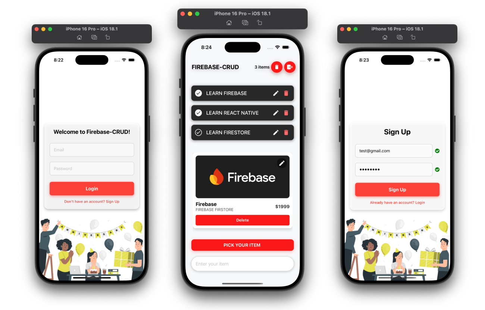
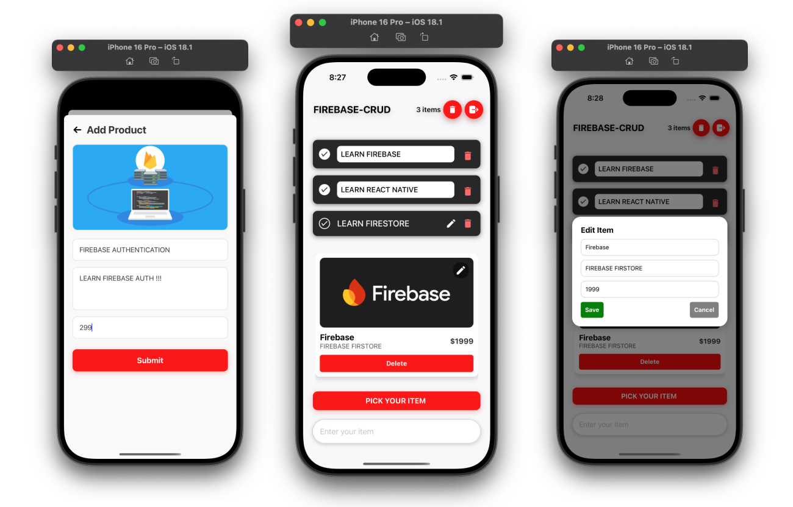
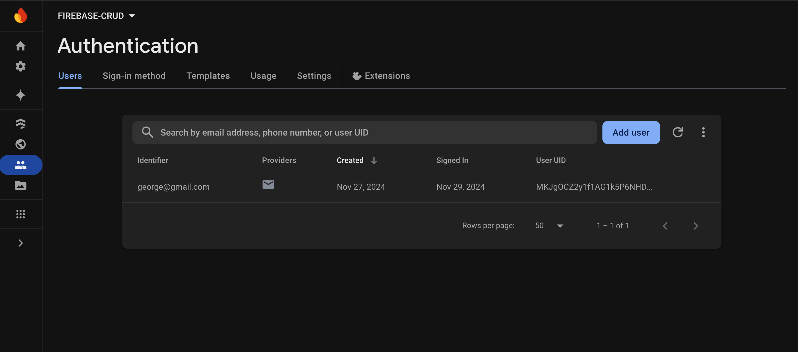
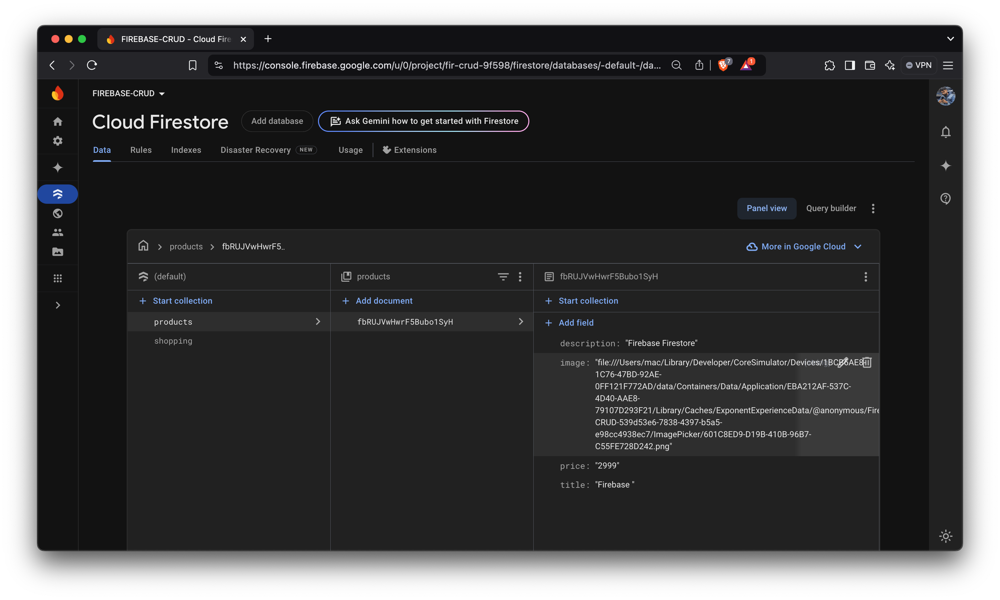

# Firebase CRUD Application 🔥

A Firebase CRUD (Create, Read, Update, Delete) app is a simple application demonstrating how to perform basic operations on a Firestore database using Firebase services. This repository includes an example implementation of these operations and serves as a starting point for Firebase-based projects.

#  Features ✨

- Create: Add new entries to the Firestore database.

- Read: Fetch and display data from Firestore in real time.

- Update: Modify existing entries in the Firestore database.

- Delete: Remove entries from the Firestore database.

- Real-time updates using Firestore listeners.

- Firebase Authentication for secure access control.


##  Screenshots


##  Firebase Backend 🔐




# Packages Used 📦 

This project uses the following npm packages:

- firebase: For integrating Firebase services like Firestore and Authentication.
- react-native: React Native library for mobile app development.
- firebase: SDK to connect the app with Firebase services.
- @react-navigation/native: Enables screen navigation.
- react-native-screens: Optimizes navigation performance.
- react-native-gesture-handler: Handles user gestures and touch interactions.
- expo: Toolset for building React Native apps with ease.

# Functionality 🛠️  💻  

Authentication:

- Sign up or log in to access the app.

- Authentication is managed using Firebase Authentication.

CRUD Operations:

- Use the interface to create, read, update, and delete entries.
- All changes are reflected in real-time: Simplifies Firebase data fetching and authentication 

# Getting Started  🚀

>**Note**: Make sure you have completed the [React Native - Environment Setup](https://reactnative.dev/docs/environment-setup) instructions till "Creating a new application" step, before proceeding.

## Step 1: Start the Metro Server

First, you will need to start **Metro**, the JavaScript _bundler_ that ships _with_ React Native.

To start Metro, run the following command from the _root_ of your React Native project:

## Run Locally

Clone the project

```bash
  git clone https://github.com/blessengeorge30/FIREBASE-CRUD-EXPO-main
```

Go to the project directory

```bash
  cd cd FIREBASE-CRUD-EXPO-main
```

Install dependencies

```bash
  npm install
```

Set up Firebase:

Add your Firebase project configuration to the firebaseConfig file (usually src/firebaseConfig.js or .env for environment variables).

Example Firebase config:
```bash
const firebaseConfig = {
  apiKey: "your-api-key",
  authDomain: "your-app.firebaseapp.com",
  projectId: "your-project-id",
  storageBucket: "your-app.appspot.com",
  messagingSenderId: "your-messaging-sender-id",
  appId: "your-app-id"
};
export default firebaseConfig;
```

Start the server

```bash
  npx expo start
```
